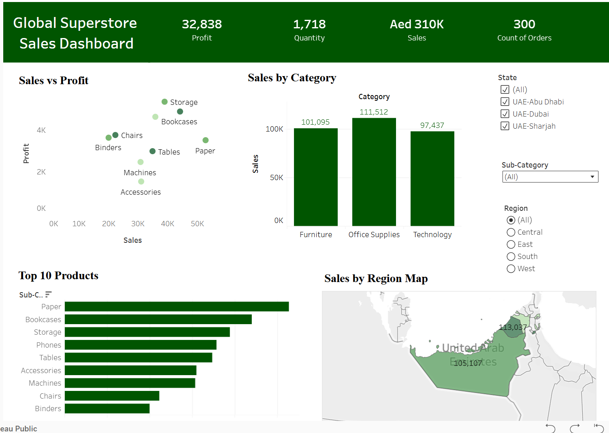
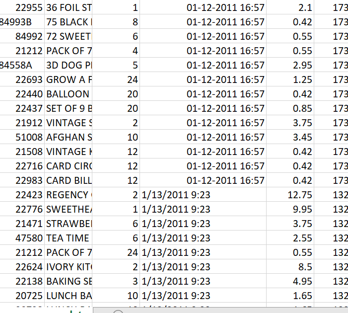

# Global Superstore Sales Analysis

## 📌 Objective

Analyze sales performance to identify trends, top-performing categories, and profitability insights.

## 🛠 Tools Used

* Excel (Data Cleaning, Pivot Tables)
* Tableau (Dashboard & Visualization)

## 📊 Key Insights

* Office Supplies generated the highest sales
* Paper is the top-selling sub-category
* Some products have high sales but low profit
* Profit varies significantly across categories

## 📈 Dashboard

## 📂 Dataset

Global Superstore Dataset (public dataset)

## 🚀 Skills Demonstrated

* Data Cleaning
* Data Visualization
* Business Insights
* Dashboard Design

## 🧹 Data Cleaning in Excel

Before performing analysis, the dataset was cleaned and prepared using Excel to ensure accuracy and consistency.

---

### 🔍 Steps Performed in Excel

- Removed unnecessary or blank columns  
- Renamed columns for clarity  
- Checked and handled missing values  
- Removed duplicate records using **Remove Duplicates**  
- Converted date column to proper date format  
- Ensured numeric fields (Sales, Quantity) were correctly formatted  
- Applied filters to identify and correct inconsistent data  

---

### 🛠️ Excel Features Used

- Filter and Sort  
- Remove Duplicates  
- Text to Columns  
- Find & Replace  
- Data Formatting (Date & Number)  
- Pivot Tables for validation  

---

## 📊 Result

- Clean and structured dataset ready for analysis  
- No duplicate or inconsistent records  
- Correct data types for all columns  
- Improved data quality for accurate insights

## 📸 Data Cleaning Preview

